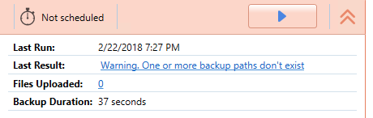

# Warning. One or more backup paths do not exist

## 1. Problem {#1-problem}

After running a backup plan you see the error: **“Warning. One or more backup paths don’t exist”**.  

## 2. Introduction {#2-introduction}

Let's start with the description of services and privileges required for this to work.

#### How it works {#how-it-works}

Cloudberry Backup \(or online backup, in case of Cloudberry Managed Backup\) works as a Windows Service and starts up under Local System account.

At the same time Cloudberry Backup agent \(UI\) works under user's privileges who ran the application.

#### Why does that matter? {#why-does-that-matter}

This approach has both, upsides and downsides.

Upside: Backup schedule start backup job/plan even if no users are currently logged on the server.

Downside: When configuring a backup plan in the application currently logged on users' privileges will be used to browse folders/drives/network shares. Backup agent might not have permissions to access all of the paths specified in the job/plan.

#### What is Local System account? {#what-is-local-system-account}



According to the article: 

`"It has extensive privileges on the local computer, and acts as the computer on the network. Its token includes the NT AUTHORITY\SYSTEM and BUILTIN\Administrators SIDs; these accounts have access to most system objects."` 

And considering the fact that most companies have password rotation policy that requires to change passwords every 2-3 months, changing the password and leaving our backup agent using the previous password may interrupt backup routine. Now imagine you need to change this password on 100+ machines at any given time. Thus, it's a bad practice to change Local System account to any other account with Administrator's privileges.

By default, Local System account has access to all files on a local computer/server, but often when a server's role is a file-server the permissions for shared folders are being adjusted and System can be deleted from accounts who are granted to read the data.

To make sure that the backup service is running under Local System account you can go to `C:\Windows\System32` and locate the file `services.msc` and double click on it, locate the service and see the account that is used there.

## 3. Which files haven't been backed up? {#how-to-determine-which-paths-are-no-longer-exist}

* Check your diagnostic information \(log files\). Tools -&gt; Options -&gt; Diagnostic -&gt; Open in Folder and check log-file with some \(almost random\) id. You will find which files/folder backup plan couldn't access.
* In the agent, on tab “History”, filter by “files” and in the list you’ll find which files have been skipped.

## 4. What do these errors mean? {#4-what-do-these-errors-mean}

* `Warning. One or more backup paths don’t exist.`

The resource is not accessible via the network, you need to configure sharing properly.

## 5. Suggestions and Resolution​ {#5-suggestions-and-resolution}

Now we need to configure sharing:

  

 Nota bene

